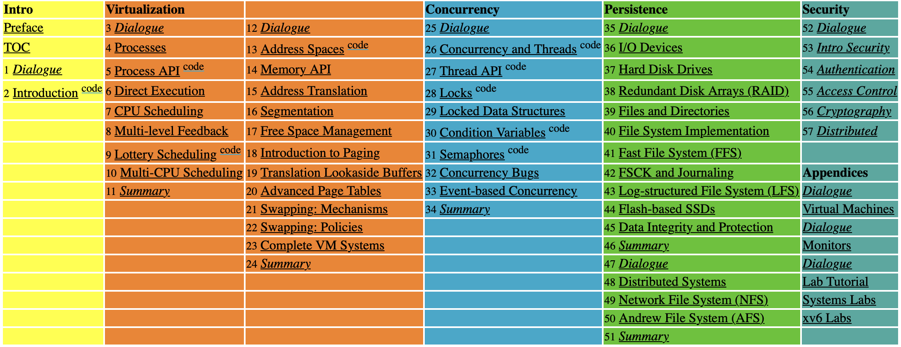

## 概述

*Operating Systems: Three Easy Pieces*（中文译名《操作系统导论》）是由美国威斯康星大学麦迪逊分校的 Remzi H. Arpaci-Dusseau 与 Andrea C. Arpaci-Dusseau 教授合著的经典操作系统教材，可通过 <a href="https://pages.cs.wisc.edu/~remzi/OSTEP/">官网 </a>免费获取核心资源。本书围绕操作系统至关重要的三大核心概念展开：**虚拟化**、**并发**与**持久性**，串联起现代操作系统的所有关键组件，逻辑清晰且层层递进。在理解这些核心概念的同时，你还将掌握实用技能，包括操作系统如何进行 CPU 调度、内存管理以及文件的持久化存储等底层工作机制。
